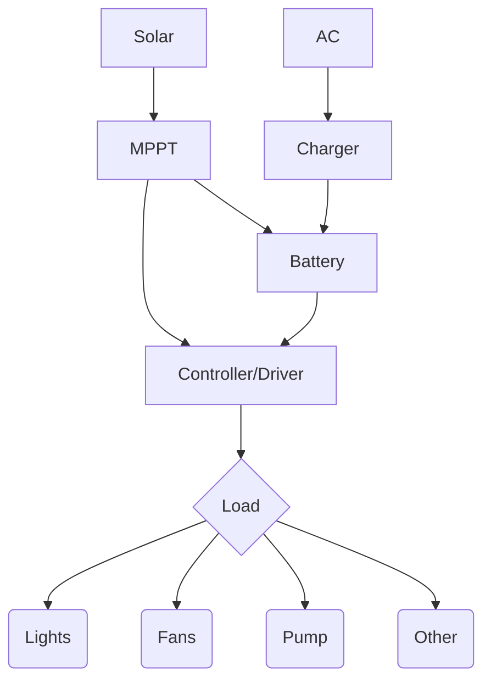

## Power

Box is powered by a 48VDC rail that drives all the equipment.

## Power Need Calculation

- Lights + Pumps + Fans + Other == Total Watts Needed

### 150 Watt Lamps

| Device | Power  | Time | Watt-Hours |
|--------|-------:|-----:|-----------:|
| Lights | 1200W  | 12   | 14400      |
| Fans   | 250W   | 24   | 6000       |
| Pumps  | 100W   | 2    | 200        |
| Other  | 100W   | 24   | 2400       |
| Total  | 1650W  |      | 23000      |

At 120VAC @ 13A == 1650W this could be powered from a single 20A AC circuit.

### 800 Watt Lamps

| Device | Power  | Time | Watt-Hours |
|--------|-------:|-----:|-----------:|
| Lights | 6400W  | 12   | 76800      |
| Fans   | 250W   | 24   | 2400       |
| Pumps  | 100W   | 2    | 200        |
| Other  | 100W   | 24   | 2400       |
| Total  | 6850W  |      | 81620 (81kWh)  |

At 120VAC @ 58A == 6850W.
This would need three 20A circuts to operate;
At 240VAC @ 29A == 6850W
